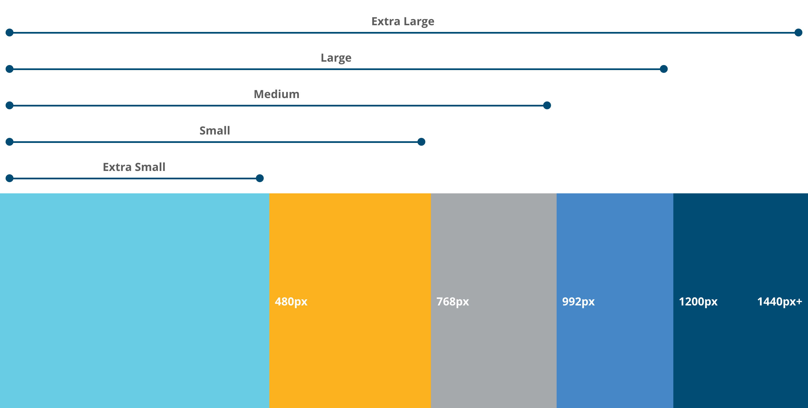

import { Playground } from "docz";
import { Grid, Row, Col, Clearfix } from "react-bootstrap";

# Grid System

## Breakpoints

Breakpoints are the minimum and maximum widths at which a browser responds to different screen sizes, orientations and devices. The breakpoints listed below are the Bluebird Design System recommendations based on common widths of devices. As a rule for best practice, create any designs at the lowest end of the breakpoint. This will help ensure any design will not break on the lowest end of the breakpoint spectrum.

| Design Token         | Display Size         | Value         |
| -------------------- | -------------------- | ------------- |
| `$screen-xs-min`     | Extra Small          | 480px         |
| `$screen-sm-min`     | Small                | 768px         |
| `$screen-md-min`     | Medium               | 992px         |
| `$screen-lg-min`     | Large                | 1200px        |
| `$screen-xl-desktop` | Extra Large          | 1440px        |

## Media Queries
Media queries can be used to manipulate or modify a screen. Media queries for screen widths should always be written using the `min-width` property.

| Media Query                                      | What it does                          |
| ------------------------------------------------ | ------------------------------------- |
| `@media (min-width: $screen-xs-min) {...}`       | Targets screen widths 480px and up    |
| `@media (min-width: $screen-sm-min) {...}`       | Targets screen widths 768px and up    |
| `@media (min-width: $screen-md-min) {...}`       | Targets screen widths 992px and up    |
| `@media (min-width: $screen-lg-min) {...}`       | Targets screen widths 1200px and up   |
| `@media (min-width: $screen-xl-desktop) {...}`   | Targets screen widths 1440px and up   |

## Basic Grid

Bootstrap's grid system consists of `<Row>` elements that contain `<Col>` elements. 

<Playground>
  <Grid fluid={true}>
    
    

      
{'<Row />'}

      <Row>
        <Col md={6}>
          

            
{'<Col />'}

          

        </Col>
        <Col md={6}>
          

            
{'<Col />'}

          

        </Col>
      </Row>
    
  
    
  </Grid>
</Playground>

Columns can be split into segments that sum to 12, according to the screen size. So, `<Col lg={6}>` is a column that on large screens is 6/12 (or 1/2) the size of the row. `<Col md={9}>` is a column that on medium and large screens is 9/12 (or 3/4) the size of the row. 

<Playground>
  <Grid fluid={true}>
    
    

      
{'<Row />'}

      <Row>
        <Col md={6}>
          

            
{'<Col md={6}/>'}

          

        </Col>
        <Col md={9}>
          

            
{'<Col md={9}/>'}

          

        </Col>
      </Row>
    
  

  </Grid>
</Playground>

By mixing and matching screen sizes you can adjust the columns to collapse in the desired fashion. Also common is to hide or show columns at certain screen sizes, eg. `xsHidden`. Rows with columns that sum to more than 12 automatically cascade.

Below examples include borders for convenience.

<Playground>
  <Grid fluid={true}>
    
    

      
{'<Row />'}

      <Row>
        <Col xs={12} md={8}>
          

            
{'<Col xs={12} md={8} />'}

          

        </Col>
        <Col xs={6} md={4}>
          

            
{'<Col xs={6} md={4} />'}

          

        </Col>
      </Row>
    
  

    

      
{'<Row />'}

      <Row>
        <Col xs={12} md={8}>
          

            
{'<Col xs={6} md={4}  />'}

          

        </Col>
        <Col xs={12} md={8}>
          

            
{'<Col xs={6} md={4} />'}

          

        </Col>
        <Col xsHidden md={4} >
          

            
{'<Col xsHidden md={4} />'}

          

        </Col>
      </Row>
    
  
  
    

      
{'<Row />'}

      <Row>
        <Col xs={6} xsOffset={6}>
          

            
{'<Col xs={6} xsOffset={6} />'}

          

        </Col>
      </Row>
    
  

    

      
{'<Row />'}

      <Row>
        <Col md={6} mdPush={6}>
          

            
{'<Col md={6} mdPush={6} />'}

          

        </Col>
        <Col md={6} mdPull={6}>
          

            
{'<Col md={6} mdPull={6} />'}

          

        </Col>
      </Row>
    
  

  </Grid>
</Playground>

## Clearfix

Use Clearfix and set to visible for the viewports with columning issues, so that columns can clear correctly.

<Playground>
  {() => {
    const dummySentences = [
      'Lorem ipsum dolor sit amet, consectetuer adipiscing elit.',
      'Donec hendrerit tempor tellus.',
      'Donec pretium posuere tellus.',
      'Proin quam nisl, tincidunt et, mattis eget, convallis nec, purus.',
      'Cum sociis natoque penatibus et magnis dis parturient montes, nascetur ridiculus mus.',
      'Nulla posuere.',
      'Donec vitae dolor.',
      'Nullam tristique diam non turpis.',
      'Cras placerat accumsan nulla.',
      'Nullam rutrum.',
      'Nam vestibulum accumsan nisl.'
    ];

    return (
      <Grid fluid={true}>
        

          
{'<Row />'}

          <Row>
            <Col sm={6} md={3}>
              

                

                  &lt;
                  {'Col sm={6} md={3}'} /&gt;
                

                 
                {dummySentences.slice(0, 6).join(' ')}
              

            </Col>
            <Col sm={6} md={3}>
              

                

                  &lt;
                  {'Col sm={6} md={3}'} /&gt;
                

                 
                {dummySentences.slice(0, 4).join(' ')}
              

            </Col>
            <Clearfix visibleSmBlock>
              <code>
                {'<Clearfix visibleSmBlock />'}
              </code>
            </Clearfix>
            <Col sm={6} md={3}>
              

                

                  &lt;
                  {'Col sm={6} md={3}'} /&gt;
                

                 
                {dummySentences.slice(0, 6).join(' ')}
              

            </Col>
            <Col sm={6} md={3}>
              

                

                  &lt;
                  {'Col sm={6} md={3}'} /&gt;
                

                 
                {dummySentences.slice(0, 2).join(' ')}
              

            </Col>
          </Row>
        

      </Grid>
    );

}}

</Playground>
